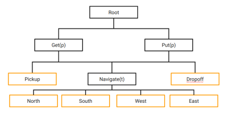

<h2>Hierarchical Reinforcement Learning Method for OpenAI Gym's Taxi-v3 Environment.</h2>

<h3>Introduction</h3>

This project has been developed as the final project for the Reinforcement Learning course in the Master's in Artificial Intelligence at Universidad Carlos III de Madrid.

The research explores the performance of Hierarchical Reinforcement Learning (HRL) in comparison to the traditional approach of reinforcement learning, specifically in the OpenAI Gym Taxi environment (Brockman et al. 2016). In this case, it is suggested that applying a hierarchical structure in the learning process can significantly improve the agent's effectiveness and efficiency in solving tasks. Through systematic experiments and comparative evaluations, we demonstrate that the HRL approach achieves superior performance in terms of convergence time and final performance compared to traditional reinforcement learning methods, primarily for complex environments such as those involving multiple passengers. These results support the efficiency of the hierarchical approach in enhancing the agent's adaptability and decision-making capabilities in the specific context of the taxi problem. This work contributes to understanding the applicability and benefits of hierarchical reinforcement learning in practical environments.

By transferring the learned hierarchy from a single-person problem to an extended version involving two people, we achieve a more robust learning of the task in fewer episodes compared to a strategy solely based on Q-Learning.

The hierarchy extension involves treating GET and PUT tasks as parameterized tasks (p), analogous to what the original paper proposes for the Navigate task, where p represents the person on whom to perform the operation.



<h3>Installation</h3>

Python version used: 3.10

Using conda:

```bash
conda create -f environment.yml
cd src
pip install -e custom
```

Using pip:
```bash
pip install -r requirements.txt
cd src 
pip install -e custom
```


<h2> Author </h2>
Daniel Cabrera Rodríguez

Github: @dan415

Email: danicr2515@gmail.com

Please, do not hesitate to contact if you have any questions or suggestions.


<h2> License </h2>

MIT License
Copyright (c) 2024 Daniel Cabrera Rodriguez

Permission is hereby granted, free of charge, to any person obtaining 
a copy of this software and associated documentation files (the "Software"), 
to deal in the Software without restriction, including without limitation the
rights to use, copy, modify, merge, publish, distribute, sublicense, and/or 
sell copies of the Software, and to permit persons to whom the Software is 
furnished to do so, subject to the following conditions:

The above copyright notice and this permission notice shall be 
included in all copies or substantial portions of the Software.

THE SOFTWARE IS PROVIDED "AS IS", WITHOUT WARRANTY OF ANY KIND,
EXPRESS OR IMPLIED, INCLUDING BUT NOT LIMITED TO THE WARRANTIES OF MERCHANTABILITY, 
FITNESS FOR A PARTICULAR PURPOSE AND NONINFRINGEMENT. IN NO EVENT SHALL THE AUTHORS OR 
COPYRIGHT HOLDERS BE LIABLE FOR ANY CLAIM, DAMAGES OR OTHER LIABILITY, WHETHER IN AN ACTION 
OF CONTRACT, TORT OR OTHERWISE, ARISING FROM, OUT OF OR IN CONNECTION WITH THE SOFTWARE OR 
THE USE OR OTHER DEALINGS IN THE SOFTWARE.


